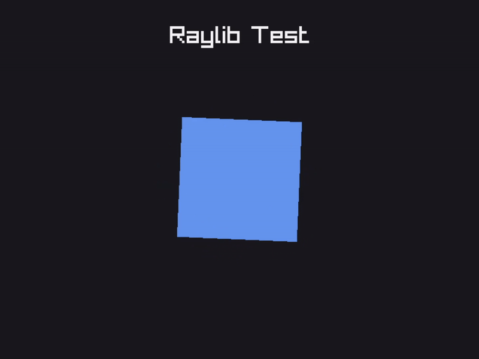

# pdvm


`pdvm` is a small stack-based VM language implemented in C. It supports typed scalar values, packed structs, byte-backed memory, labels and jumps, a simple file preprocessor, and dynamic library calls through `dlcall`.

The main reference is [docs/documentation.md](docs/documentation.md). The bundled programs live in [examples/](examples).

## Build

The recommended build path is `nob`, which also builds the vendored `libffi` sources when available.

Windows with MinGW:

```powershell
gcc nob.c -o nob.exe
.\nob.exe --release
```

Linux or macOS:

```bash
cc nob.c -o nob
./nob --release
```

`nob` currently knows how to build the vendored `libffi` path for x86/x64 targets. If that path is not usable on the current host, `pdvm` still builds, but `dlcall` support is disabled.

## Run

Run a script file:

```bash
./pdvm examples/hello_world.pdvm
```

## Docs

- Full language and VM reference: [docs/documentation.md](docs/documentation.md)
- Example programs: [examples/](examples)
- Cross-platform raylib demo: [examples/raylib_test/raylib_test.pdvm](examples/raylib_test/raylib_test.pdvm)
